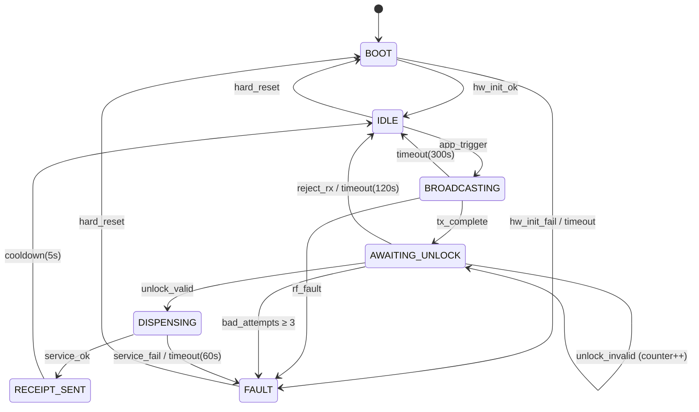
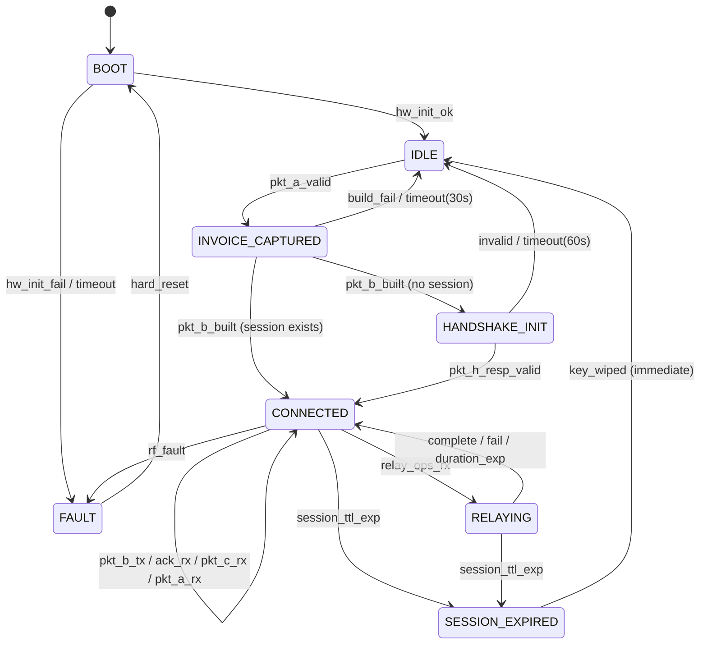
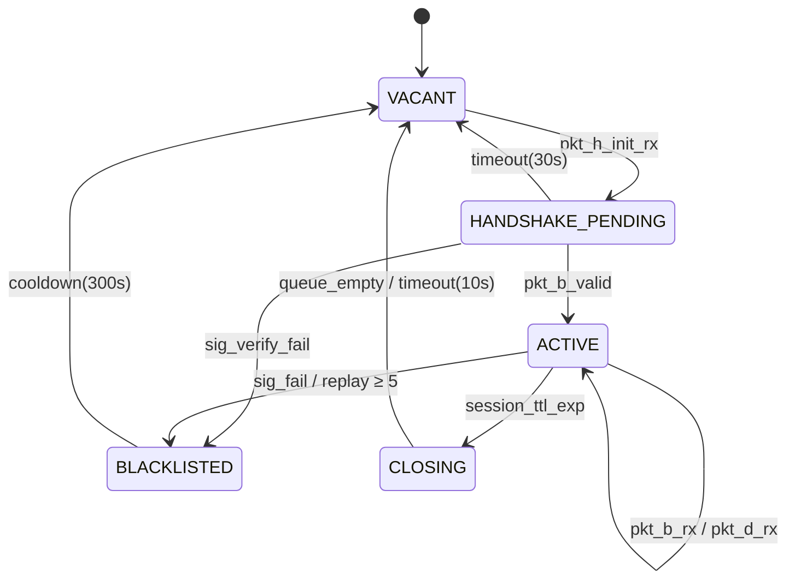

# VOID Protocol v2.1 — Deterministic State Machine Specification

> **Authority:** Tiny Innovation Group Ltd
>
> **License:** Apache 2.0
>
> **Status:** Hardened / Formally Verifiable
>
> **Target:** ESP32-S3 / ARM Cortex-M / RISC-V (128KB Static Footprint)
>
> **Dependency:** Requires `void_protocol.ksy` (Hardened) for wire format definitions.
>
> **Design Constraint:** Zero-Heap. All state is held in a single `node_state_t` struct,
> statically allocated at boot. No dynamic transitions. No unbounded queues.

---

## 1. Design Principles

This specification defines the **deterministic finite state machines** (DFSMs) governing
packet acceptance, cryptographic session lifecycle, and fault recovery for every node role
in the VOID Protocol. Each state machine is designed to be:

**Formally Verifiable.** Every state has an explicit, bounded set of valid transitions.
There are no implicit "catch-all" handlers. An event not listed in a state's transition
table is a **hard reject** — logged, counted, and discarded.

**Constant-Time.** The transition function for any state is a single `switch` on the
event type. No loops, no recursive lookups, no heap allocations. The worst-case
execution path through any transition is bounded and measurable at compile time.

**Fail-Closed.** Any ambiguous condition — clock drift beyond tolerance, unexpected
packet type, signature verification failure, CRC mismatch — drives the machine toward
`FAULT` or `IDLE`, never toward a more permissive state. Recovery from `FAULT` requires
an explicit reset event, not a timeout.

**Auditable.** Every state transition emits a `transition_record_t` into a fixed-size
circular log (32 entries). This log is included in the next Heartbeat packet, giving
the Ground Station full visibility into the node's behavioral history without requiring
a dedicated telemetry channel.

---

## 2. Node Roles & State Machines

The protocol defines three node roles. Each role has its own independent state machine.
A physical device runs exactly **one** role, selected at provisioning time via `void-cli`.

| Role | Description | State Machine |
|---|---|---|
| **Sat A** (Seller) | Broadcasts invoices, dispenses service on unlock. | `sm_seller` |
| **Sat B** (Mule/Buyer) | Captures invoices, relays payments, stores receipts. | `sm_mule` |
| **Ground Station** | Settlement authority. Validates, settles, commands. | `sm_ground` |

---

## 3. Sat A — The Seller State Machine (`sm_seller`)

Sat A is the simplest role. It broadcasts offers, waits for authorization, executes
a service, and proves it did so.

### 3.1 State Definitions

| State | ID | Description | Timeout |
|---|---|---|---|
| `BOOT` | 0x00 | Hardware init, PUF key load, self-test. | 10s → `FAULT` |
| `IDLE` | 0x01 | Radio off. Awaiting application trigger to broadcast. | None (indefinite) |
| `BROADCASTING` | 0x02 | Periodically transmitting Packet A (Invoice). | Configurable (default 300s) → `IDLE` |
| `AWAITING_UNLOCK` | 0x03 | Invoice sent. Listening for Tunnel Data (Unlock). | 120s → `IDLE` |
| `DISPENSING` | 0x04 | Service execution in progress. | Service-dependent (max 60s) → `FAULT` |
| `RECEIPT_SENT` | 0x05 | Packet C generated and transmitted. Cooldown before next cycle. | 5s → `IDLE` |
| `FAULT` | 0xFF | Unrecoverable error. Radio silenced. Heartbeat-only mode. | None (requires hard reset) |

### 3.2 Transition Table

```
┌──────────────────┐
│      BOOT        │
│  hw_init_ok ─────┼──────────────────────► IDLE
│  hw_init_fail ───┼──────────────────────► FAULT
│  timeout(10s) ───┼──────────────────────► FAULT
└──────────────────┘

┌──────────────────┐
│      IDLE        │
│  app_trigger ────┼──────────────────────► BROADCASTING
│  hard_reset ─────┼──────────────────────► BOOT
└──────────────────┘

┌──────────────────┐
│  BROADCASTING    │
│  tx_complete ────┼──────────────────────► AWAITING_UNLOCK
│  timeout(300s) ──┼──────────────────────► IDLE
│  rf_fault ───────┼──────────────────────► FAULT
└──────────────────┘

┌──────────────────┐
│ AWAITING_UNLOCK  │
│  unlock_rx_valid ┼──────────────────────► DISPENSING
│  unlock_rx_bad ──┼──────────────────────► AWAITING_UNLOCK (counter++)
│  reject_rx ──────┼──────────────────────► IDLE
│  bad_attempts≥3 ─┼──────────────────────► FAULT
│  timeout(120s) ──┼──────────────────────► IDLE
└──────────────────┘

┌──────────────────┐
│   DISPENSING     │
│  service_ok ─────┼──────────────────────► RECEIPT_SENT
│  service_fail ───┼──────────────────────► FAULT
│  timeout(60s) ───┼──────────────────────► FAULT
└──────────────────┘

┌──────────────────┐
│  RECEIPT_SENT    │
│  cooldown(5s) ───┼──────────────────────► IDLE
└──────────────────┘

┌──────────────────┐
│     FAULT        │
│  hard_reset ─────┼──────────────────────► BOOT
│  (all others) ───┼──────────────────────► FAULT (no-op, stay)
└──────────────────┘
```

### 3.3 Packet Acceptance Matrix

This table defines which packet types are **accepted** in each state. Any packet
not listed for a given state is silently discarded after CRC validation. CRC-invalid
packets are always discarded regardless of state — they never reach the state machine.

| State | Accepts | Action |
|---|---|---|
| `BOOT` | None | Radio receiver is off during self-test. |
| `IDLE` | Heartbeat (internal) | Generate and queue heartbeat on timer. |
| `BROADCASTING` | None inbound | Tx-only mode. Receiver disabled between broadcasts to save power. |
| `AWAITING_UNLOCK` | Tunnel Data (from ACK) | Validate: GROUND_SIG, CMD_CODE=0x0001, TTL > 0, BLOCK_NONCE matches. |
| `DISPENSING` | None | Service execution is atomic. No radio activity. |
| `RECEIPT_SENT` | None | Cooldown. Radio returns to idle after timer. |
| `FAULT` | None (except heartbeat tx) | Heartbeat transmitted with `sys_state = 0x06 (error)`. |

### 3.4 Security Controls

**Unlock Validation (AWAITING_UNLOCK → DISPENSING):**
The Tunnel Data extracted from the ACK's `enc_tunnel` must pass all five checks
before the transition fires. Failure on any single check increments the
`bad_unlock_counter` and holds the state.

1. **Decrypt:** `enc_tunnel` decrypted with `Session_Key` (derived during Handshake).
   Decryption failure = reject.
2. **CRC32:** Inner `CRC32` (Tunnel offsets 84–87) verified. Mismatch = reject.
3. **GROUND_SIG:** 64-byte Ed25519 signature verified against Ground Authority
   public key. Invalid = reject.
4. **BLOCK_NONCE:** Must match a pending transaction in Sat A's local ledger.
   Unknown nonce = reject (possible replay).
5. **TTL:** `TTL > 0` and current time < `session_start + session_ttl`.
   Expired = reject.

**Bad Attempt Escalation:**
The `bad_unlock_counter` is a 2-bit saturating counter (max value 3). It resets
to zero on any valid state transition out of `AWAITING_UNLOCK`. If it reaches 3
(three consecutive invalid unlock attempts), the machine transitions to `FAULT`.
This prevents brute-force unlock attempts during a single pass window.

---

## 4. Sat B — The Mule State Machine (`sm_mule`)

Sat B is the most complex role. It manages the Handshake lifecycle, captures invoices,
constructs payment packets, stores receipts, and handles bidirectional relay.

### 4.1 State Definitions

| State | ID | Description | Timeout |
|---|---|---|---|
| `BOOT` | 0x00 | Hardware init, PUF key load, self-test. | 10s → `FAULT` |
| `IDLE` | 0x01 | Listening for Packet A (Invoices) on ISM band. | None (indefinite) |
| `INVOICE_CAPTURED` | 0x02 | Valid Packet A received. Preparing Packet B. | 30s → `IDLE` |
| `HANDSHAKE_INIT` | 0x03 | Packet H (Init) sent to Ground. Awaiting Packet H (Resp). | 60s → `IDLE` |
| `CONNECTED` | 0x04 | Session established. Full duplex: Tx Packet B/D, Rx ACK. | `session_ttl` → `SESSION_EXPIRED` |
| `RELAYING` | 0x05 | Actively transmitting relay data per `RELAY_OPS` instructions. | `duration_ms` → `CONNECTED` |
| `SESSION_EXPIRED` | 0x06 | TTL exhausted. Wipe session key. Return to idle. | 0s (immediate) → `IDLE` |
| `FAULT` | 0xFF | Unrecoverable error. Heartbeat-only. | None (requires hard reset) |

### 4.2 Transition Table

```
┌──────────────────────┐
│        BOOT          │
│  hw_init_ok ─────────┼──────────────────► IDLE
│  hw_init_fail ───────┼──────────────────► FAULT
│  timeout(10s) ───────┼──────────────────► FAULT
└──────────────────────┘

┌──────────────────────┐
│        IDLE          │
│  pkt_a_rx_valid ─────┼──────────────────► INVOICE_CAPTURED
│  pkt_a_rx_invalid ───┼──────────────────► IDLE (discard, stay)
│  hard_reset ─────────┼──────────────────► BOOT
└──────────────────────┘

┌──────────────────────┐
│  INVOICE_CAPTURED    │
│  pkt_b_built ────────┼──────────────────► HANDSHAKE_INIT*
│  pkt_b_build_fail ───┼──────────────────► IDLE
│  timeout(30s) ───────┼──────────────────► IDLE
└──────────────────────┘
  * If a valid session already exists (CONNECTED was reached before
    and session_ttl has not expired), skip HANDSHAKE and transition
    directly to CONNECTED with the queued Packet B.

┌──────────────────────┐
│   HANDSHAKE_INIT     │
│  pkt_h_resp_valid ───┼──────────────────► CONNECTED
│  pkt_h_resp_invalid ─┼──────────────────► IDLE (wipe ephemeral key)
│  timeout(60s) ───────┼──────────────────► IDLE (wipe ephemeral key)
└──────────────────────┘

┌──────────────────────┐
│     CONNECTED        │
│  pkt_b_tx_ok ────────┼──────────────────► CONNECTED (dequeue next)
│  pkt_ack_rx_valid ───┼──────────────────► CONNECTED (process ACK)
│  relay_ops_rx ───────┼──────────────────► RELAYING
│  pkt_c_rx_valid ─────┼──────────────────► CONNECTED (queue receipt)
│  pkt_a_rx_valid ─────┼──────────────────► CONNECTED (queue new invoice)
│  fifo_full ──────────┼──────────────────► CONNECTED (drop oldest)
│  session_ttl_exp ────┼──────────────────► SESSION_EXPIRED
│  rf_fault ───────────┼──────────────────► FAULT
└──────────────────────┘

┌──────────────────────┐
│     RELAYING         │
│  relay_complete ─────┼──────────────────► CONNECTED
│  relay_fail ─────────┼──────────────────► CONNECTED (log error)
│  duration_exp ───────┼──────────────────► CONNECTED
│  session_ttl_exp ────┼──────────────────► SESSION_EXPIRED
└──────────────────────┘

┌──────────────────────┐
│  SESSION_EXPIRED     │
│  (auto) key_wiped ───┼──────────────────► IDLE
└──────────────────────┘
  * SESSION_EXPIRED is a transient state. On entry:
    1. Session_Key is securely zeroed from RAM.
    2. Ephemeral private key is confirmed destroyed (should already be).
    3. FIFO queue is NOT flushed — queued receipts persist for next session.
    4. Transition to IDLE is immediate (same execution cycle).

┌──────────────────────┐
│       FAULT          │
│  hard_reset ─────────┼──────────────────► BOOT
│  (all others) ───────┼──────────────────► FAULT (no-op)
└──────────────────────┘
```

### 4.3 Packet Acceptance Matrix

| State | Accepts | Action |
|---|---|---|
| `BOOT` | None | — |
| `IDLE` | Packet A | Validate CRC32. Check `asset_id` is stablecoin. Check `epoch_ts` freshness (< 60s). |
| `INVOICE_CAPTURED` | None inbound | Tx prep only. Building Packet B in static buffer. |
| `HANDSHAKE_INIT` | Packet H (Response) | Validate Ground Authority signature. Derive `Session_Key`. |
| `CONNECTED` | Packet A, Packet ACK, Packet C | Full duplex. All inbound packets validated per type-specific rules. |
| `RELAYING` | None | Tx-only. Relay window is atomic. |
| `SESSION_EXPIRED` | None | Transient cleanup state. |
| `FAULT` | None (heartbeat tx only) | — |

### 4.4 FIFO Queue Management

The 10-receipt FIFO (`receipt_fifo_t`) is statically allocated and operates under
strict rules regardless of state machine position.

**Enqueue (Packet C received in CONNECTED):**

1. Decrypt `enc_tx_id` using `Session_Key`.
2. Scan FIFO for duplicate `tx_id` (linear scan, 10 entries max = bounded).
3. If duplicate: discard immediately. Increment `dedup_counter`.
4. If FIFO full: evict slot 0 (oldest). Shift entries. Insert at slot 9.
5. If FIFO has space: insert at next empty slot.

**Dequeue (Ground pass in CONNECTED):**

1. Wrap oldest receipt in Packet D.
2. Transmit Packet D.
3. On ACK receipt with matching `TARGET_TX_ID`: remove entry, compact FIFO.
4. On no ACK within `relay_ops.duration_ms`: retain entry for next pass.

**Session Boundary:**

The FIFO is **not** flushed on `SESSION_EXPIRED`. Receipts are valid across sessions
because they carry Sat A's PUF signature, which is session-independent. They are only
evicted by the drop-oldest policy or by confirmed ACK.

### 4.5 Security Controls

**Handshake Validation (HANDSHAKE_INIT → CONNECTED):**

1. Verify `Packet H (Resp)` signature using Ground Authority public key.
2. Check `timestamp` is within 10s of local GPS-disciplined clock.
3. Derive shared secret: `X25519(eph_priv, ground_pub)`.
4. Derive `Session_Key`: `HKDF-SHA256(shared_secret, salt=timestamp, info="void-session-v2.1")`.
5. **Immediately destroy** `eph_priv` from RAM (overwrite with zeros, then random bytes, then zeros).
6. Set `session_deadline = timestamp + session_ttl`.
7. Transition to `CONNECTED`.

If any step fails, wipe all ephemeral material and return to `IDLE`.

**Invoice Freshness (IDLE → INVOICE_CAPTURED):**

Packet A's `epoch_ts` must be within 60 seconds of the local clock. This prevents
Sat B from relaying stale invoices that Sat A may have already fulfilled through
another mule. The 60-second window accounts for clock drift between non-synchronized
GPS receivers in LEO.

**Receipt Authentication (CONNECTED, Packet C inbound):**

Sat B cannot verify Sat A's PUF signature (it doesn't have Sat A's public key database).
It can only verify:
1. CRC32 integrity.
2. `enc_tx_id` decrypts to a valid (non-zero) value.
3. The `tx_id` is not already in the FIFO (deduplication).

This is a known limitation. A malicious Sat A could inject fake receipts into Sat B's
FIFO, consuming queue slots. The 10-entry limit bounds the damage, and the Ground Station
performs full PUF verification on receipt, so fake receipts don't cause financial harm — they
only waste FIFO capacity and radio bandwidth.

**Receipt Token Enhancement (Recommended):**

To mitigate FIFO flooding, Sat B should derive a 4-byte `receipt_token` during the
original Packet B construction:

```
receipt_token = HMAC-SHA256(Session_Key, tx_nonce)[0:4]   // Truncated to 4 bytes
```

This token is included in Packet B (transmitted to Ground) and stored locally. When
Packet C arrives, Sat B checks that the decrypted `enc_tx_id` hashes to a known
`receipt_token` before queuing. This proves the receipt corresponds to a transaction
that Sat B actually initiated, without requiring Sat A's public key.

---

## 5. Ground Station — The Settlement Authority (`sm_ground`)

The Ground Station is the only role with access to the full key database and the
L2 smart contract interface. It operates as an event-driven server, not a cyclic
state machine. However, it maintains **per-session state** for each active satellite
connection.

### 5.1 State Definitions (Per-Session)

Each satellite contact window (Acquisition of Signal to Loss of Signal) creates
an independent session state machine instance. The Ground Station maintains a
static array of `MAX_CONCURRENT_SESSIONS` (default: 8) session slots.

| State | ID | Description | Timeout |
|---|---|---|---|
| `VACANT` | 0x00 | Slot is empty. Available for new session. | — |
| `HANDSHAKE_PENDING` | 0x01 | Packet H (Init) received. Response sent. Awaiting confirmation. | 30s → `VACANT` (wipe slot) |
| `ACTIVE` | 0x02 | Session established. Processing Packet B/D, issuing ACK. | `session_ttl` → `CLOSING` |
| `CLOSING` | 0x03 | TTL expired. Flushing pending ACKs. | 10s → `VACANT` (wipe slot) |
| `BLACKLISTED` | 0xFE | Session terminated due to security violation. Slot locked for cooldown. | 300s → `VACANT` |

### 5.2 Transition Table

```
┌──────────────────────┐
│       VACANT         │
│  pkt_h_init_rx ──────┼──────────────────► HANDSHAKE_PENDING
│  pkt_b_rx (no sess) ─┼──────────────────► VACANT (reject, log)
└──────────────────────┘

┌──────────────────────┐
│  HANDSHAKE_PENDING   │
│  pkt_b_rx_valid ─────┼──────────────────► ACTIVE
│  pkt_h_init_retry ───┼──────────────────► HANDSHAKE_PENDING (resend resp)
│  sig_verify_fail ────┼──────────────────► BLACKLISTED
│  timeout(30s) ───────┼──────────────────► VACANT
└──────────────────────┘

┌──────────────────────┐
│       ACTIVE         │
│  pkt_b_rx_valid ─────┼──────────────────► ACTIVE (settle + ACK)
│  pkt_d_rx_valid ─────┼──────────────────► ACTIVE (verify receipt, close escrow)
│  pkt_b_rx_replay ────┼──────────────────► ACTIVE (discard, increment counter)
│  sig_verify_fail ────┼──────────────────► BLACKLISTED
│  replay_count ≥ 5 ───┼──────────────────► BLACKLISTED
│  session_ttl_exp ────┼──────────────────► CLOSING
└──────────────────────┘

┌──────────────────────┐
│      CLOSING         │
│  ack_queue_empty ────┼──────────────────► VACANT (wipe session)
│  timeout(10s) ───────┼──────────────────► VACANT (wipe session, log undelivered ACKs)
└──────────────────────┘

┌──────────────────────┐
│    BLACKLISTED       │
│  cooldown(300s) ─────┼──────────────────► VACANT
│  (all packets) ──────┼──────────────────► BLACKLISTED (silently drop)
└──────────────────────┘
```

### 5.3 Packet Acceptance Matrix

| State | Accepts | Action |
|---|---|---|
| `VACANT` | Packet H (Init) | Allocate slot. Validate PUF signature. Generate ground ephemeral keypair. Send H (Resp). |
| `HANDSHAKE_PENDING` | Packet B, Packet H (retry) | First valid Packet B confirms session. H retry triggers response resend. |
| `ACTIVE` | Packet B, Packet D | Full settlement processing. Each Packet B triggers smart contract escrow. Each Packet D triggers receipt verification + fund release. |
| `CLOSING` | Packet D only | Accept late-arriving receipts. Reject new Packet B (session ending). |
| `BLACKLISTED` | None | All packets from the blacklisted APID/sat_id are silently dropped for the cooldown duration. |

### 5.4 Settlement Processing (ACTIVE State)

**Packet B Received (Payment):**

1. Decrypt `enc_payload` using `Session_Key` (CCSDS tier) or read plaintext (SNLP tier).
2. Verify inner invoice CRC32.
3. Verify PUF `signature` (64 bytes) against Sat B's public key.
4. Check `nonce` > `last_nonce` for this `sat_id`. If not: reject (replay).
5. Update `last_nonce`.
6. Submit to L2 Smart Contract: escrow `amount` of `asset_id` from Sat B's wallet.
7. On escrow success: construct ACK with `STATUS=0x01`, queue for uplink.
8. On escrow failure: construct ACK with `STATUS=0xFF`, queue for uplink.

**Packet D Received (Delivery):**

1. Extract 98-byte `payload` (stripped Packet C).
2. Reconstruct signed message using inner CCSDS APID (identifies Sat A).
3. Decrypt `enc_tx_id` and `enc_status` using `Session_Key`.
4. Verify Sat A's PUF `signature` against Sat A's public key from the Authority database.
5. Match `enc_tx_id` against pending escrow transactions.
6. If match + valid signature + `enc_status == 0x01`: release escrow funds to Sat A.
7. Emit `COMPLETED` event to transaction log.

### 5.5 Security Controls

**Session Slot Exhaustion Protection:**

The `MAX_CONCURRENT_SESSIONS` limit (8 slots) prevents a denial-of-service attack where
an adversary floods the Ground Station with Packet H (Init) from spoofed APIDs. Each
slot allocation requires PUF signature verification — computationally expensive but
bounded. If all slots are occupied, new Packet H packets are queued (max queue depth: 4)
or dropped with a `SLOT_EXHAUSTION` log entry.

**Blacklist Escalation:**

A session moves to `BLACKLISTED` on:
1. Ed25519 signature verification failure (forged identity).
2. Five or more replay attempts within a single session (nonce manipulation attack).
3. Packet B with `asset_id` not in the verified stablecoin whitelist.

The 300-second cooldown prevents rapid reconnection. The blacklist is per-`sat_id`,
not per-APID, so an attacker cannot circumvent it by changing their APID.

**TinyGS Trusted Station Enforcement (Community Tier):**

When the Ground Station needs to uplink an ACK, the `trusted_stations.json` lookup
is performed atomically within the `ACTIVE` state:

1. Identify which TinyGS station relayed the inbound packet (from MQTT metadata).
2. Look up station ID in `trusted_stations.json`.
3. If trusted: publish ACK to `tinygs/station/{id}/tx` immediately.
4. If untrusted: hold ACK in the pending queue. Do not attempt transmission.
5. On next inbound packet from a trusted station: flush pending ACK queue.

This ensures the protocol never transmits through an unverified station, even if it
means delaying settlement by one orbital pass.

---

## 6. Cross-Role Timing Constraints

These timing constraints apply across all three state machines and must be enforced
consistently. All times are relative to GPS-disciplined clocks.

| Constraint | Value | Enforced By | Rationale |
|---|---|---|---|
| Handshake freshness | 10s | Ground, Sat B | GPS clock accuracy is ±1s in LEO. 10s covers worst-case cold-start drift. |
| Invoice freshness | 60s | Sat B | Accounts for inter-satellite link propagation delay at LEO distances. |
| Replay window | 10s | Ground | Tightened from original 60s. GPS-disciplined clocks on both sides make 10s viable. Reduces replay attack surface by 6x. |
| Session TTL | 60–7200s | All roles | Configurable per Packet H. LEO pass = 600s typical. Drone/Rover = 3600s+. |
| FIFO retention | Indefinite | Sat B | Receipts survive session boundaries. Only evicted by ACK confirmation or drop-oldest. |
| Blacklist cooldown | 300s | Ground | Five minutes. Long enough to span a typical LEO pass, preventing reconnection during the same overhead window. |
| FAULT recovery | Manual only | Sat A, Sat B | `FAULT` state requires physical reset (power cycle or `void-cli reset`). No automatic recovery from `FAULT` — this is deliberate. An unattended node in `FAULT` should stay silent until a human investigates. |
| Heartbeat interval | 30s | All roles | Transmitted in all states except `BOOT`. Provides continuous liveness signal to Ground Station coverage analysis. |

---

## 7. The Heartbeat Subsystem

The Heartbeat is a **parallel process**, not a state in the main state machine. It
runs on a hardware timer interrupt and operates independently of the current state.
This ensures the Ground Station always has telemetry, even when the main state machine
is in `FAULT`.

### 7.1 Heartbeat Generation Rules

1. **Timer fires every 30 seconds** (configurable at provisioning).
2. Populate `heartbeat_body` fields from hardware sensors (ADC, GPS, barometer).
3. Set `sys_state` to the current main state machine state ID.
4. **Append transition log:** The `reserved_interval` field (2 bytes) in the current
   heartbeat spec is reserved for 2026 expansion. When this expansion lands, use it
   to encode the last 4 state transitions as a packed bitfield (4 × 4-bit state IDs).
5. Compute CRC32.
6. **Authentication:** Append a 16-byte truncated HMAC-SHA256 using a heartbeat-specific
   key derived from the PUF identity key: `hb_key = HKDF(PUF_key, info="void-heartbeat-v2.1")`.
   This extends the heartbeat from 34 → 50 bytes (still within single LoRa packet limits).
7. Queue for transmission on next radio availability.

### 7.2 Heartbeat Security Model

Without the HMAC, heartbeats are trivially forgeable. An attacker on the same LoRa
frequency could inject false GPS coordinates, battery levels, and system states. The
Ground Station uses heartbeat data for coverage mapping, health monitoring, and pass
scheduling — all of which are corrupted by forged heartbeats.

The HMAC key (`hb_key`) is derived from the PUF identity key, which means only a node
with the correct hardware PUF can produce valid heartbeats. The Ground Station verifies
the HMAC using the node's public key before ingesting any heartbeat data.

The HMAC does **not** provide replay protection for heartbeats — an attacker can capture
and rebroadcast a valid heartbeat. However, the `epoch_ts` field allows the Ground Station
to detect stale heartbeats (> 30s old = discard). For coverage analysis purposes, this
level of protection is sufficient. The heartbeat is a monitoring signal, not a settlement
instrument.

---

## 8. Error Classification & Fault Codes

Every rejected packet or failed operation produces a `fault_code_t` that is stored in the
transition log and reported via the next heartbeat.

| Code | Name | Severity | State Impact |
|---|---|---|---|
| `0x01` | `CRC_MISMATCH` | LOW | Discard packet. Stay in current state. |
| `0x02` | `STALE_TIMESTAMP` | LOW | Discard packet. Increment stale counter. |
| `0x03` | `DUPLICATE_NONCE` | MEDIUM | Discard packet. Increment replay counter. |
| `0x04` | `SIG_VERIFY_FAIL` | HIGH | Discard packet. Increment bad-auth counter. May trigger `BLACKLIST` or `FAULT`. |
| `0x05` | `INVALID_ASSET_ID` | HIGH | Discard packet. Log violation. On Ground: → `BLACKLISTED`. |
| `0x06` | `SESSION_KEY_FAIL` | CRITICAL | Wipe all ephemeral material. → `IDLE` (Sat B) or `VACANT` (Ground). |
| `0x07` | `FIFO_OVERFLOW` | LOW | Drop oldest entry. Log eviction. Stay in `CONNECTED`. |
| `0x08` | `HARDWARE_FAULT` | CRITICAL | → `FAULT`. Radio silenced. Heartbeat-only. |
| `0x09` | `SLOT_EXHAUSTION` | MEDIUM | Queue or drop Packet H. Log. Stay in current state (Ground only). |
| `0x0A` | `DISPATCH_AMBIGUOUS` | MEDIUM | Body type ID mismatch after dispatch. Discard entire packet. |
| `0x0B` | `TTL_EXPIRED` | LOW | Session or packet TTL exceeded. Clean shutdown path. |
| `0x0C` | `ESCROW_FAIL` | HIGH | Smart contract rejected escrow. Issue ACK with `STATUS=0xFF`. |

### 8.1 Fault Escalation Policy

Severity levels drive automatic escalation:

**LOW** — Increment counter. No state change. Counter resets on successful operation.

**MEDIUM** — Increment counter. If counter exceeds threshold within a session, escalate
to HIGH. Thresholds: `DUPLICATE_NONCE` ≥ 5, `SLOT_EXHAUSTION` ≥ 8.

**HIGH** — Immediate defensive action per the state-specific rules (blacklist, fault, or
session teardown). Counter does not reset — persists until session ends or node resets.

**CRITICAL** — Immediate transition to `FAULT` (device) or `VACANT` + wipe (Ground session).
No recovery without external intervention.

---

## 9. Implementation Notes

### 9.1 The `node_state_t` Struct

The entire state machine for any role fits in a single statically-allocated struct.
No heap. No pointers to dynamically-sized buffers. Every field has a bounded size.

```c
// Approximate memory footprint
typedef struct {
    uint8_t   role;                      //   1B  (0=SellerA, 1=MuleB, 2=Ground)
    uint8_t   state;                     //   1B  Current state ID
    uint8_t   prev_state;                //   1B  Previous state (for transition log)
    uint8_t   fault_code;                //   1B  Last fault code
    uint32_t  session_deadline;          //   4B  Unix timestamp
    uint32_t  last_nonce;                //   4B  Replay protection
    uint8_t   bad_unlock_counter;        //   1B  Sat A: consecutive bad unlocks
    uint8_t   replay_counter;            //   1B  Ground: replay attempts this session
    uint8_t   stale_counter;             //   1B  General: stale timestamp count
    uint8_t   _pad;                      //   1B  Alignment
    uint8_t   session_key[32];           //  32B  ChaCha20 session key
    uint8_t   receipt_token[4];          //   4B  Sat B: HMAC-derived receipt token
    // --- FIFO (Sat B only) ---
    uint8_t   fifo_count;               //   1B
    uint8_t   fifo_head;                //   1B
    uint8_t   _fifo_pad[2];             //   2B  Alignment
    uint8_t   fifo[10][98];             // 980B  10 × 98-byte stripped receipts
    // --- Transition Log ---
    uint8_t   log_head;                 //   1B
    uint8_t   log_count;                //   1B
    uint8_t   _log_pad[2];             //   2B  Alignment
    uint32_t  log[32];                  // 128B  32 × packed(timestamp[16]+from[4]+to[4]+fault[8])
    // --- Heartbeat ---
    uint8_t   hb_key[32];              //  32B  HMAC key for heartbeat authentication
} node_state_t;                        // ~1232 Bytes Total
```

Total: approximately **1.2 KB**. Well within the 128KB ceiling, leaving ample room for
the packet parsing buffers (184B max), the radio driver state, and the GPS/sensor drivers.

### 9.2 Transition Function Signature

```c
// Returns: new state ID. Never allocates. Never blocks.
uint8_t sm_transition(
    node_state_t *state,        // Mutable state struct
    uint8_t       event,        // Event ID (packet type or timer)
    const uint8_t *pkt_buf,     // Packet buffer (NULL for timer events)
    uint16_t      pkt_len       // Packet length (0 for timer events)
);
```

The transition function is a pure function of (current_state × event). It reads from
`pkt_buf` but never stores pointers to it — all relevant data is copied into `node_state_t`
fields before the function returns. This ensures the packet buffer can be safely reused
by the radio driver immediately after the call.

### 9.3 Compile-Time Verification

The transition table should be implemented as a `const` 2D array indexed by
`[state][event]`. The compiler can verify at build time that:

1. Every `(state, event)` pair maps to exactly one target state (no ambiguity).
2. No target state exceeds `STATE_MAX` (bounds check).
3. The `FAULT` state only transitions to `BOOT` (single exit).
4. The total size of `node_state_t` fits within the static allocation budget.

```c
// Example: compile-time transition table
typedef struct {
    uint8_t next_state;
    uint8_t fault_code;     // 0x00 = no fault
    uint8_t action_id;      // Index into action function pointer table
} transition_t;

static const transition_t sm_table[STATE_COUNT][EVENT_COUNT] = {
    // [IDLE][PKT_A_RX_VALID] = { .next_state = INVOICE_CAPTURED, .fault_code = 0, .action_id = ACT_CAPTURE_INVOICE },
    // [IDLE][PKT_A_RX_INVALID] = { .next_state = IDLE, .fault_code = FAULT_CRC, .action_id = ACT_LOG_DISCARD },
    // ... exhaustively defined for all pairs
};
```

Any `(state, event)` pair not explicitly defined in the table maps to `{ .next_state = current_state, .fault_code = 0, .action_id = ACT_DISCARD }` — a hard reject that stays in the current state.

---

## 10. Mermaid State Diagrams

### 10.1 Sat A (Seller)



### 10.2 Sat B (Mule)



### 10.3 Ground Station (Per-Session)



---

*END OF STATE MACHINE SPECIFICATION*

*This document is the authoritative reference for protocol behavior. The KSY files define
what the packets look like. This document defines when they are valid.*

*© 2026 Tiny Innovation Group Ltd.*
