```mermaid
sequenceDiagram
    autonumber

    box rgb(30, 30, 35) Space Segment
        participant SatA as 🛰️ Sat A (Seller)
        participant SatB as 🛰️ Sat B (Buyer/Mule)
    end

    box rgb(20, 20, 20) Ground Segment
        participant Ground as 📡 Ground Station
        participant DB as 🗄️ Lookup DB
        participant Chain as ⛓️ L2 Chain
    end

    %% PHASE 1: ONBOARDING
    rect rgb(35, 30, 30)
        Note over SatA, Chain: 🟢 PHASE 1: ONBOARDING (Factory / Pre-Flight)

        Note over SatA, Ground: 86-Character Passphrase Generated
        SatA->>SatA: 🔑 SHA-256 (HW) -> 32-byte Master Key
        SatB->>SatB: 🔑 SHA-256 (HW) -> 32-byte Master Key

        alt is PUF Capable?
            SatA->>SatA: 🔑 Derive Key from Silicon (PUF)
        else is Legacy?
            SatA->>SatA: 🔑 Load C2 Encryption Keys
        end

        SatA->>Chain: ⛽ Onboard Ether/Gas (L2)
        SatA-->>DB: Export {SatID, PublicKey}
        DB->>DB: 📝 Register in "Allowed Sats" Table
    end

    %% PHASE 2: HANDSHAKE (AOS)
    rect rgb(50, 20, 50)
        Note over SatB, Ground: 🟣 PHASE 2: HANDSHAKE (AOS / Session Start)
        
        SatB->>SatB: 🎲 Gen Ephemeral Keys (X25519)
        SatB->>SatB: ✍️ Sign (Timestamp + TTL + PubKey)
        SatB->>Ground: 📡 Broadcast PACKET H (Init) [112 Bytes]
        
        Ground->>Ground: 🔍 Verify Sat B Signature
        Ground->>Ground: 🎲 Gen Ground Ephemeral Keys
        Ground->>Ground: 🧮 Derive SESSION_KEY (ECDH)
        Ground->>SatB: 📡 Transmit PACKET H (Resp) [112 Bytes]

        SatB->>SatB: 🔍 Verify Ground Signature
        SatB->>SatB: 🧮 Derive SESSION_KEY (ECDH)
        SatB->>SatB: 🗑️ Wipe Ephemeral PrivKey (Forward Secrecy)
        Note right of SatB: Session Active (TTL Window)
    end

    %% PHASE 3: THE DEAL
    rect rgb(30, 35, 45)
        Note over SatA, Chain: 🔵 PHASE 3: THE DEAL (In-Orbit)

        SatA->>SatA: 🔒 Encrypt Invoice (ChaCha20)
        SatA->>SatB: 📡 Broadcast PACKET A (Invoice)
        Note right of SatA: 68 Bytes (Optimized)<br/>[CCSDS | Pos | Vel | Cost]


        SatB->>SatB: 🔓 Decrypt (Verify Price/Terms)
        SatB->>SatB: 📦 Wrap -> PACKET B (176 Bytes)
        SatB->>SatB: 🔒 Encrypt Payload w/ SESSION_KEY
        SatB->>SatB: ✍️ Sign with PUF Signature (Offsets 0-107)
    end

    %% PHASE 4: SETTLEMENT
    rect rgb(45, 45, 30)
        Note over SatA, Chain: 🟠 PHASE 4: SETTLEMENT (The 60s Window)

        SatB->>Ground: ⬇️ Downlink PACKET B (176 Bytes)

        Ground->>DB: 🔍 Resolve Sat B Public Key
        Ground->>Ground: ✅ Verify Sat B PUF Signature
        Ground->>Ground: 🔓 Decrypt Payload (SESSION_KEY)

        Ground->>Chain: 💸 Execute Settlement (L2)
        Chain-->>Ground: ✅ Confirmed
    end

    %% PHASE 5: THE ACK BURST
    rect rgb(40, 30, 40)
        Note over SatA, Chain: 🟣 PHASE 5: ACK BURST (Downlink)

        Ground->>Ground: 📝 Construct TUNNEL_DATA (88 Bytes)
        Ground->>Ground: ✍️ Sign (Ground Key)
        Ground->>Ground: 🔒 Encrypt TUNNEL_DATA (SESSION_KEY)

        loop Rapid Fire (Maximize Reliability)
            Ground-->>SatB: ⬆️ Uplink ACK (120 Bytes)
            Note right of Ground: Target TX ID + Relay Ops + Tunnel
        end

        SatB->>SatB: 🧠 Read Status=0x01
        SatB->>SatB: 🧠 Match TARGET_TX_ID (Cleartext)
        SatB->>SatB: 🗑️ Clear Pending TX from RAM
        SatB->>SatB: 💾 Store ENC_TUNNEL (88 Bytes)
    end

    %% PHASE 6: THE RELAY
    rect rgb(30, 40, 30)
        Note over SatA, Chain: 🟢 PHASE 6: EXECUTION (Space Relay)

        loop For DURATION ms (defined in Relay Ops)
            SatB->>SatA: 📡 Broadcast TUNNEL_DATA (88 Bytes)
        end

       SatA->>SatA: 🔓 Decrypt (Master/Session Key)
        SatA->>SatA: 🔍 Verify Ground Signature (64-byte Sig)
        SatA->>SatA: 🔓 EXECUTE: UNLOCK / DISPENSE
    end

    %% PHASE 7: THE RECEIPT
    rect rgb(30, 40, 50)
        Note over SatA, Chain: 🔵 PHASE 7: RECEIPT (Loop Close)

        SatA->>SatA: 📝 Create PACKET C (Receipt)
        SatA->>SatA: 🔒 Encrypt Status/ID (ChaCha20)
        SatA->>SatB: 📡 Transmit PACKET C (104 Bytes)

        SatB->>SatB: 🔓 Decrypt ID (Deduplication)
        SatB->>SatB: 📦 Strip & Wrap -> PACKET D (128 Bytes)
        SatB->>Ground: ⬇️ Downlink PACKET D

        Ground->>DB: 🔍 Verify Sat A Execution Sig
        Ground->>Chain: ⛓️ Update "Completed" Status
    end

    %% PHASE 8: SAFETY & FAILSAFE
    rect rgb(60, 20, 20)
        Note over SatA, Ground: 🔴 PHASE 8: SAFETY & FAILSAFE (Link Loss)

        alt Link Active
            Ground-->>SatA: 💓 Heartbeat / Command Extension
            SatA->>SatA: Continue Operation
        else Link Lost (Timeout > 120% DURATION)
            SatA->>SatA: 🛡️ TRIGGER: Dead Man's Switch
            SatA->>SatA: 🛑 EXECUTE: STOP_SEQUENCE
            SatA->>SatA: 💾 Log Failure (0xFF)
        end
    end

```

# Void Protocol — End-to-End Flow (v2.1)

> 🛰️ VOID PROTOCOL v2.1 | Tiny Innovation Group Ltd
> 
> Authority: Tiny Innovation Group Ltd
> 
> License: Apache 2.0
> 
> Status: Authenticated Clean Room Spec

The following sequence defines the lifecycle of a trustless M2M transaction, from initial factory onboarding to final escrow settlement and receipt delivery. This flow is strictly optimized for **32/64-bit hardware alignment** and the **Hybrid Endianness** model (Big-Endian Headers / Little-Endian Payloads).

---

---

## 🛰️ Finalized Metric & Retry Summary

The following table summarizes the updated packet sizes and time-box constraints, aligned with the finalized **Rule of 8/4** specifications.

| Phase | Who | Action | Final Size | Time box / Retry |
| --- | --- | --- | --- | --- |
| **Onboarding** | Device | PUF key + Sat ID → Lookup | - | One-time |
| **Handshake** | Sat B/Ground | Ephemeral Key Exchange (ECDH) | **112B** | **On AOS (Session Start)** |
| **Discovery** | Sat A | Broadcast **Packet A** (Invoice) | **68B** | Per service event |
| **Intent** | Sat B | Encapsulate & Sign **Packet B** | **176B** | Per orbital pass |
| **Settlement** | Ground | Verify & Pay on L2 | - | Until L2 confirmation |
| **ACK Downlink** | Ground → Sat B | Send **Ack Packet** (Downlink) | **120B** | **Retry until ACK or 60s** |
| **ACK Relay** | Sat B → Sat A | Broadcast **Tunnel Data** | **88B** | **DURATION ms** |
| **Unlock** | Sat A | Verify & Execute UNLOCK | - | On first valid 88B packet |
| **Receipt** | Sat A → Sat B | Transmit **Packet C** (Receipt) | **104B** | Immediately after unlock |
| **Delivery** | Sat B → Ground | Downlink **Packet D** (Delivery) | **128B** | Next available radio slot |

**End-to-End Performance Note:** The critical "Happy Path" from Ground receipt of Packet B to Sat A execution should complete within **60 seconds**. All data structures are aligned to 8-byte boundaries to minimize latency during high-speed decryption/verification on the ESP32-S3.

---

## Technical Links

* [Handshake Spec v2.1 (AOS/Session)](./Handshake-spec.md)
* [Protocol Spec v2.1 (A & B)](./Protocol-spec.md)
* [Acknowledgement Spec v2.1 (Ack & Tunnel)](./Acknowledgment-spec.md)
* [Receipt Spec v2.1 (C & D)](./Receipt-spec.md)

---

[END OF SPECIFICATION]

Verified for 32/64-bit cycle optimization.

© 2026 Tiny Innovation Group Ltd.